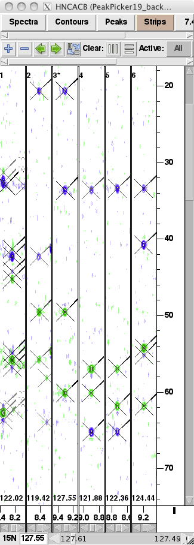

# Key deductive pictures

## Looking at one spectrum

HSQC
 - ss-sstype:  Asn/Gln sidechains, sometimes W/R sidechains, backbone

 
HNCACB
 - peak-ss: peaks aligned in 1H/15N dimensions
 - peak-peaktype: relative intensity within strip
 - peak-peakclass:  peaks along edges, in regions where no peaks are expected, peak pattern
 - ss-sstype:  backbone: Ala, Ser/Thr, Gly.  Sidechains: Asn, Gln.

## Looking at 2+ spectra

HSQC/HNCO
 - peak-peakclass: peak in one spectrum, no matching peak in other -> peak may not be signal
 - peak-ss: matching chemical shifts
 - peak: peak in one spectrum allows you to find peak in other

HSQC/HNCACB
 - pretty much the same as HSQC/HNCO
 

 
## Looking at all peaks of spin system (in all spectra)
 - ss-sstype: from BMRB statistics, peak-peaktype
 - peak-peaktype: from other peak-peaktype, matching chemical shifts

## HNCACB strips
 - sequential ss-ss: matching chemical shifts
 - i/i-1 peak-peaktype: relative intensities
 - ss-residue: ss-sstype and protein-residue-sstype
 - possibly: whether strip is contaminant
 

