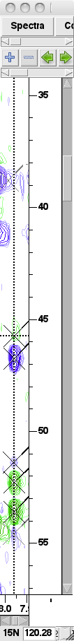
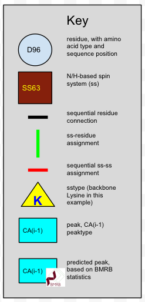
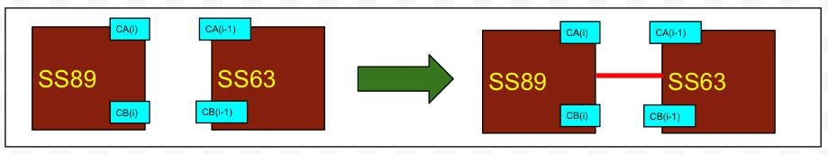
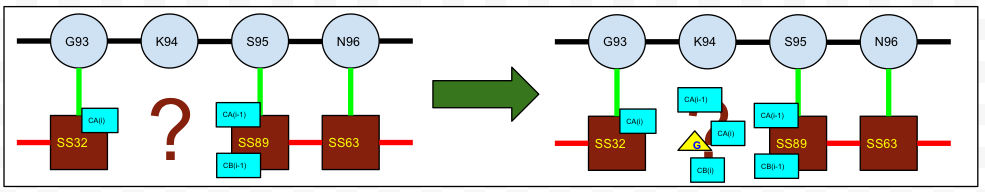

# Key deductive pictures

See [this excellent resource](http://www.protein-nmr.org.uk/solution-nmr/assignment-practise/triple-resonance-backbone-assignment/triple-resonance-backbone-assignment-manual/)
for a more detailed explanation of an assignment strategy.

## One spectrum

HSQC
 - ss-sstype:  Asn/Gln sidechains, sometimes W/R sidechains, backbone

 
HNCACB
 - peak-ss: peaks aligned in 1H/15N dimensions
 - peak-peaktype: the sign of the amplitude determines whether the peaks are 
   CA or CB (backbone), CG or CB (Gln sidechain), etc. 
 - ss-sstype: backbone: Ala, Ser/Thr, Gly.  Sidechains: Asn, Gln.  Using BMRB statistics.

 - peak-peakclass:  peaks along edges, in regions where no peaks are expected

 - peak-peakclass:  peak pattern of truncation and phase error
 

 
 - peak-peaktype:  two CA peaks already found in strip, therefore 3rd CA peak might not be signal

## 2+ spectra

HSQC/HNCACB
 - peak-ss: matching chemical shifts
 - peak: peak in one spectrum allows you to find peak in other
 

HSQC/HNCO
 - peak-peakclass: peak in one spectrum, no matching peak in other -> peak may not be signal

 - phase error or possibly misreferencing

C(CO)NH/HNCACB
 - peak-peaktype: matching peaks in both spectra must be CA(i-1) and CB(i-1);
   peaks in HNCACB only must be CA(i) and CB(i);
   peaks in C(CO)NH only must be C*(i-1), where * is neither A nor B

## HNCACB strips
 - sequential ss-ss: matching chemical shifts
 - peak-peaktype: (i)/(i-1) based on relative intensities and overlap:
   - if there are two CA peaks in a strip, the one with the lower
     intensity is usually (but not always) the CA(i-1).  
     The same applies for CB
   - if you have the two strips in which a CA peak appears, it should 
     usually have a higher intensity as a CA(i) peak than as a CA(i-1) peak.
     The same applies for CB
 

## Spin systems

 - peak, peak-peaktype, peak-ss: given ss-peak-peaktype assignments, additional peaks and their
   assignments can be predicted in many spectra (exactly which spectra and peaktypes can be 
   predicted depends on which peaktypes have already been assigned in the spin system)

   
 
 
## Sequential and sequence-specific assignment
 - key for the pictures in this section:

 - ss-residue: based on ss-sstype, residue-sstype, and other ss-residue assignments:
   process of elimination if a spin system has its sstype assigned and there's only
   one unassigned residue of that sstype remaining.  This generalizes to sequential
   ss fragments that have some or all sstypes assigned

 - ss-ss: based on chemical shift matching of overlapped atoms

 - peak-peaktype: using sequential assignments, the overlapped atoms will appear at a matching chemical shift
 

 - ss-residue: matching ss-sstype and ss-ss to residue-sstype and residue-residue
 - this doesn't require unambiguous ss-sstype assignments -- ambiguous sstype 
   assignments still narrow down the possible ss-residue assignments, and getting
   enough of them may narrow it all the way down to a single possibility

 - ss-residue: propagate sequence-specific assignments along an ss-ss chain

 - ss-sstype
 - peak: overlap with other spin systems
 - ss-peak
 - peak-peaktype

 - ss-sstype:  the spin system that will be assigned to residue 94 must be a backbone K
 - peak:  SS32(i) peaks should appear in SS? as (i-1) peaks;
          SS89(i-1) peaks should appear in SS? as (i) peaks
 - peak-peaktype: based on assignments of peaks at matching chemical shifts
                  in SS32 and SS89
 

 - peak: using BMRB statistics, residue-sstype
 - peak-peaktype

## BMRB statistics

 - peak, peak-ss: given ss-sstype
 - peak-peaktype: given chemical shifts of a peak
 - ss-sstype: given the peak-ss and peak-peaktype assignments

## Sidechain assignment

#### NHSQC, HNCACB, HBHA(CO)NH, H(CCO)NH, C(CO)NH, HCCH-Tocsy

 - use NHSQC to build spin systems
   - peak-ss assignments for other spectra are easy -- if there's no overlap
 - use HNCACB (perhaps others as well) to get sequential assignments, CA(i-1), CB(i-1)
 - use HBHA(CO)NH to get HA*(i-1) and HB*(i-1)
   - use BMRB statistics to tentatively assign peaktypes. May be splitting
 - use H(CCO)NH, C(CO)NH, and HCCH-Tocsy in conjunction to get aliphatic C, H
   - C(CO)NH, H(CCO)NH: use BMRB statistics to tentatively assign peaktypes. May be splitting
   - HCCH-Tocsy: confirm peaktype assignments using strip plot -- one strip for each aliphatic sidechain C 

HBHA(CO)NH
 - peak-ss: matching chemical shifts
 - peak-peaktype: BMRB statistics

C(CO)NH
 - peak-ss: matching chemical shifts
 - peak-peaktype: BMRB statistics, peak-peaktype from HNCACB + matching chemical shifts

H(CCO)NH
 - peak-ss: matching chemical shifts
 - peak-peaktype: BMRB statistics, peak-peaktype from HBHA(CO)NH + matching chemical shifts

HCCH-Tocsy
 - peak-ss: ?????????
 - peak-peaktype: ????????

#### HBCBCGCDHD, HBCBCGCDCEHE

 - aromatic sidechains.  what is the strategy?