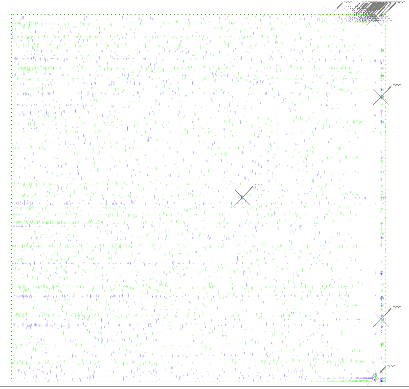

automated peak-picking:
 - data: peak
 - tool used
 - spectra peak-picked
 - parameters given

spectral re-reference:
 - data: peak-peakclass
 - spectrum used as "correct" one (could also be another source???)
 - dimensions

suspicious peak position:
 - data: peak-peakclass
 - kind
   - spectral edge
   - peaks in normally uninhabited region
 - example:

suspicious peak pattern:
 - data: peak-peakclass
 - kind
   - phase error:  peak tails
 - example:

standard Asn/Gln sidechain deduction:
 - data: peak-ss, ss-sstype
 - spectra used:
   - HNCO, NHSQC, HNCACB
 - characteristic pattern:
   - top-right quadrant of NHSQC
   - two peaks at same 15N but different 1H shifts
   - peaks have same shape
   - may be a lobe above peaks
 - example:

chemical shift matching:
 - data: 
   * peak-ss (if peaks in both spectra)
   * peak-peaktype (??? depending on assignment of one peak???)
   * peak-peakclass (if missing expected peaks)
 - from -- spectrum in which peaks are found
 - to -- spectrum in which peaks are expected/matched
 - tolerances
   - dim name: ppm

expected peak
 - data: peak (derived from peak, peak-ss, pulse sequence of spectra)
 - from -- spectrum in which peak is found
 - to -- spectrum in which peak is expected

fix mistake
 - reason mistake was found ????
 - problems mistake caused ???
 - how it was determined to be wrong ???

spin system creation
 - data: ss
 - base:  
   - nhsqc peak
   - ???

process of elimination
 - data:  ??anything??
 - initial possibilities

arginine sidechain:
 - shows up in:
   - nhsqc (NE, NH1, NH2)
   - hnco (NE, NH1, NH2, CZ)
   - hncacb (NE, NH1, NH2, CD, CG)
 - characteristic pattern
   - possible splitting in 1H dimension
   - weak
   - possible folding in 15N, 13C dimension

artifact and noise peaks should not be in spin systems 
 - (although artifacts actually could reasonably go in spin systems)

resolving overlap
 - in another spectrum, spin systems can be differentiated
 - reasons:
   - extra dimension
   - different spin system types, meaning that they may show up in different experiments/spectra
 - spectrum in which it's resolved

peaktype assignment
 - kinds
   * experiment type
   * sign of amplitude
   * peak type assignments of other peaks in same spin system
   * sstype of spin system of peak

sstype assignment
 - kinds
   * presence/absence of specific atoms
   * BMRB statistics
   * primary sequence
