## automated peak-picking
 - data: peak
 - tool used
 - spectra peak-picked
 - parameters given

## spectral re-reference
 - data: peak-peakclass
 - spectrum used as "correct" one (could also be another source???)
 - dimensions
 - example:

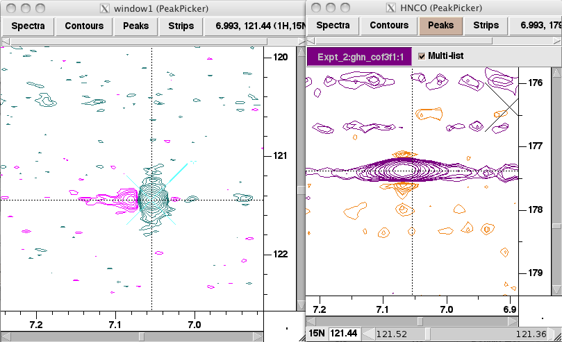

## suspicious peak position
 - data: peak-peakclass
 - kind
   - spectral edge
   - peaks in normally uninhabited region
 - example:

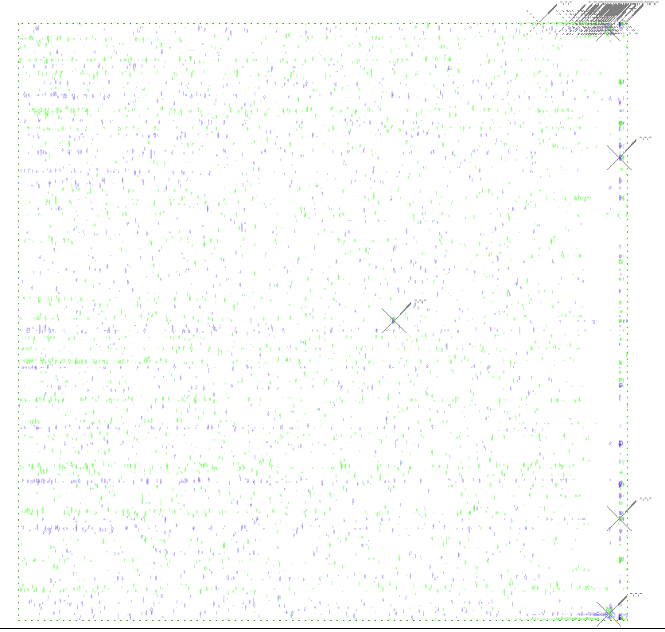

## suspicious peak pattern
 - data: peak-peakclass
 - kind
   - phase error:  peak tails
 - example:

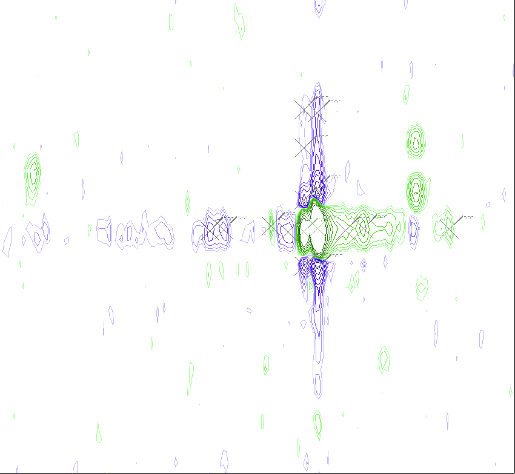

## missing/found expected peak
 - data: peak-peaktype
 - context: some peaks of a ss are found, but not all of them
 - spectrum in which the peaks are(n't) found
 - can deduce:
   - peaks expected (use for peak-peaktype assignment)
   - missing peaks
 - example:  HNCACB, backbone N-H

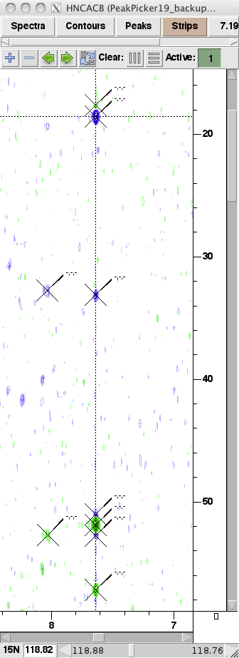

 - example: since there's already two CA peaks in this HNCACB strip, we wouldn't expect to find a third -- so it's probably an artifact

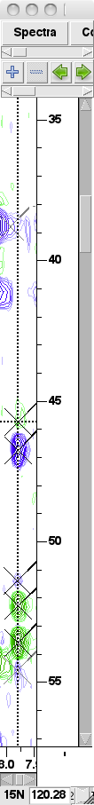

## chemical shift matching
 - data: 
   * peak-ss (if peaks in both spectra)
   * peak-peaktype (??? depending on assignment of one peak???)
   * peak-peakclass (if missing expected peaks)
 - from -- spectrum in which peaks are found
 - to -- spectrum in which peaks are expected/matched
 - tolerances
   - dim name: ppm
 - example:

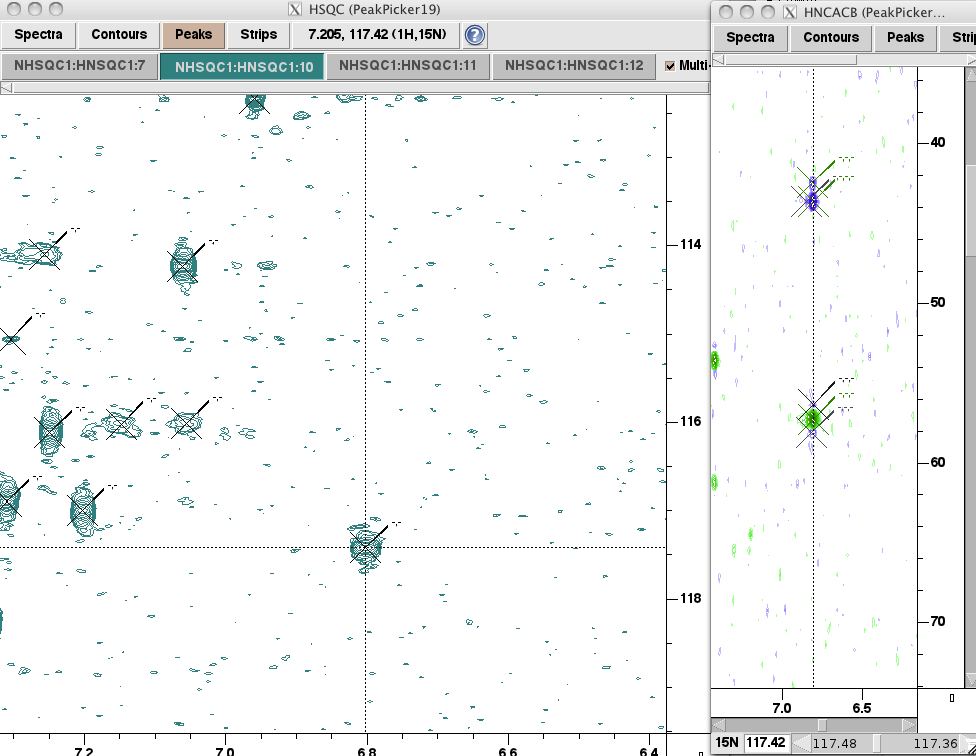

 - example 2:  peak in hncacb looks like noise, but is within tolerances close to hsqc peak, therefore shouldn't yet conclude that it's noise

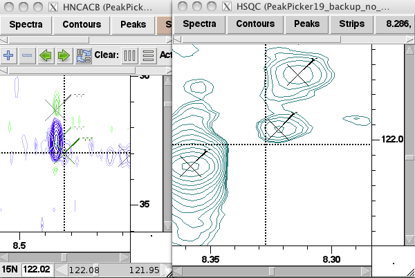

 - example 3: peak in hnco, no matching peak in hsqc

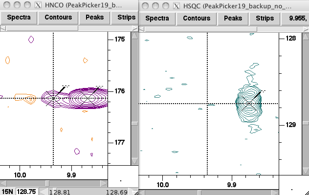

 - example 4: peak in nhsqc, nothing matching in hnco

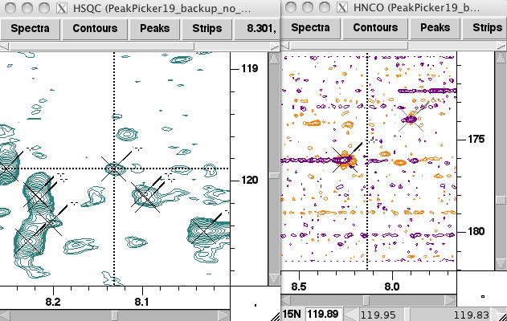

 - example 5:  better match

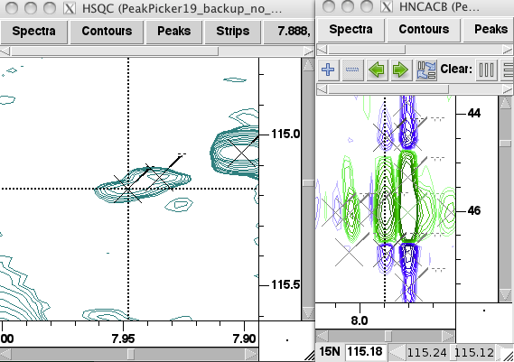

## expected peak
 - data: peak (derived from peak, peak-ss, pulse sequence of spectra)
 - from -- spectrum in which peak is found
 - to -- spectrum in which peak is expected

## fix mistake
 - reason mistake was found ????
 - problems mistake caused ???
 - how it was determined to be wrong ???

## spin system creation
 - data: ss
 - base:  
   - nhsqc peak
   - ???

## process of elimination
 - data:  ??anything??
 - initial possibilities
 - example: can't say that peak is noise, artifact, so conclude it's signal:

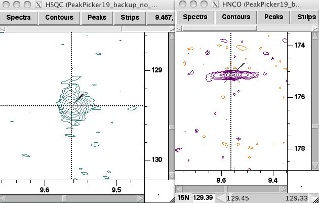

## artifact and noise peaks should not be in spin systems 
 - (although artifacts actually could reasonably go in spin systems)
 - example

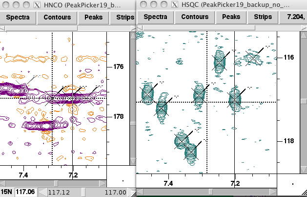

## resolving overlap
 - in another spectrum, spin systems can be differentiated
 - reasons:
   - extra dimension
   - different spin system types, meaning that they may show up in different experiments/spectra
 - spectrum in which it's resolved
 - example: overlapped sidechain-R, resolved by HNCO+HNCACB 

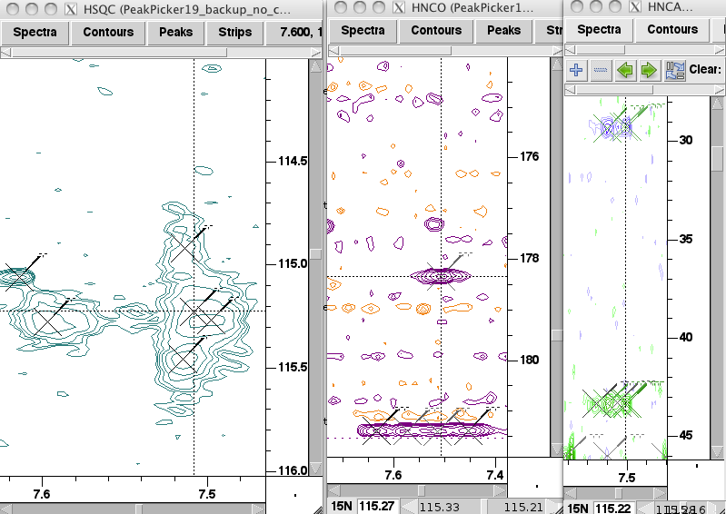

## peaktype assignment
 - kinds
   * experiment type
   * sign of amplitude
   * peak type assignments of other peaks in same spin system
   * sstype of spin system of peak
 - example 1: hncacb backbone amide -- CA/CB using sign of peak amplitude

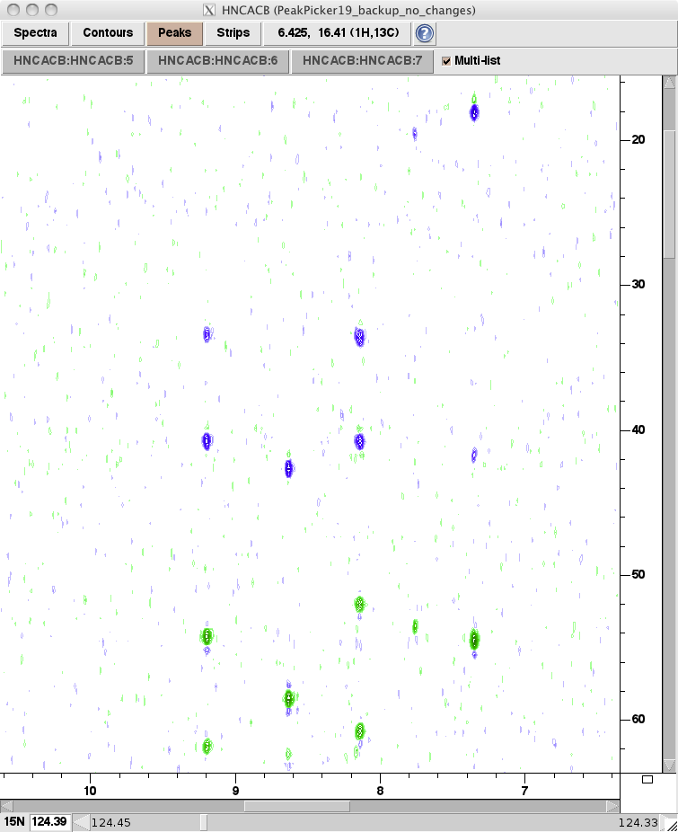

 - example 2: hncacb sidechain Asn -- sign of peak amplitude (green peaks are typically CA in this spectrum)

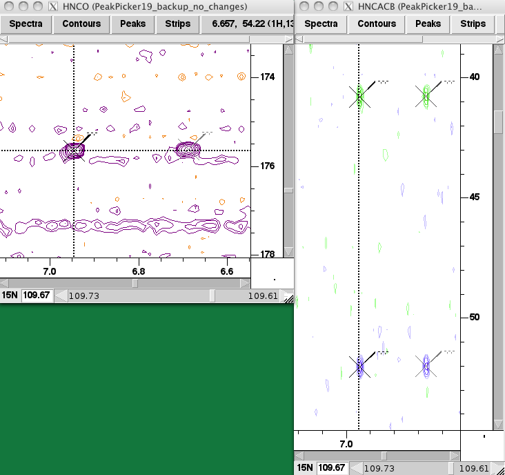

## sstype assignment
 - kinds
   * presence/absence of specific atoms
   * BMRB statistics
   * primary sequence

#### tryptophan sidechain
 - bottom left in nhsqc
 - crosspeak in hnco
 - nothing in hncacb
 - example:

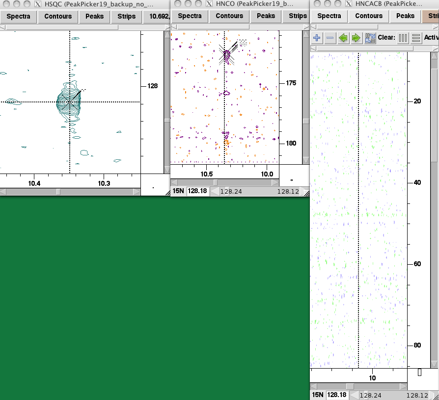

#### arginine sidechain
 - shows up in:
   - nhsqc (NE, NH1, NH2)
   - hnco (NE, NH1, NH2, CZ)
   - hncacb (NE, NH1, NH2, CD, CG)
 - characteristic pattern
   - possible splitting in 1H dimension
   - weak
   - possible folding in 15N, 13C dimension
 - example:

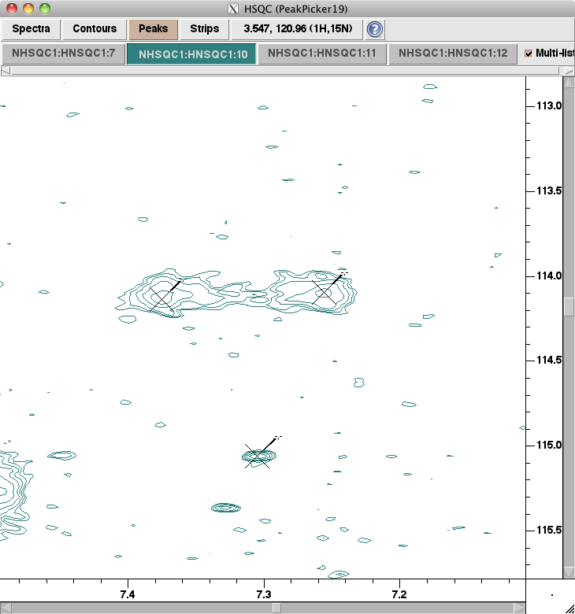

#### Asn/Gln sidechain
 - data: peak-ss, ss-sstype
 - spectra used:
   - HNCO, NHSQC, HNCACB
 - characteristic pattern:
   - top-right quadrant of NHSQC
   - two peaks at same 15N but different 1H shifts
   - peaks have same shape
   - may be a lobe above peaks
 - example:

#### Alanine backbone
 - example -- note the CB position

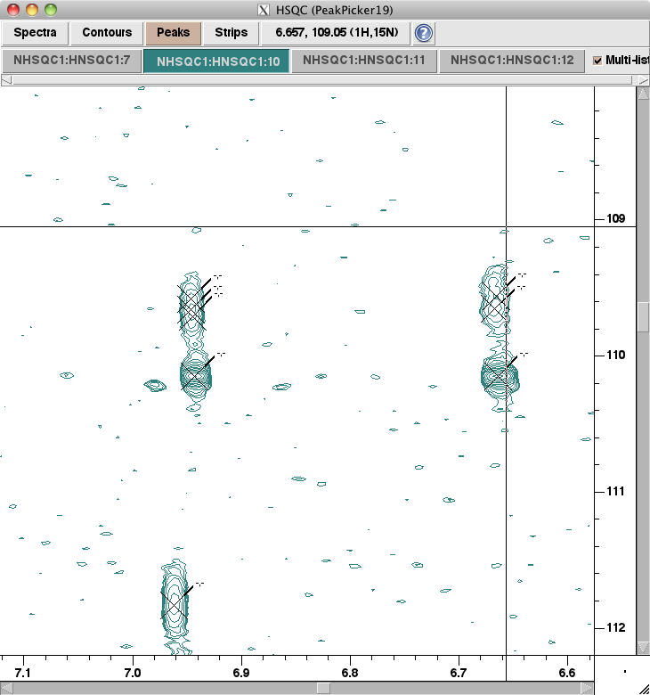

## spin system overlap
 - data:  ss-ss
 - kinds
   * matching chemical shifts (of corresponding atoms)
 - example:  an alanine ss and its following ss

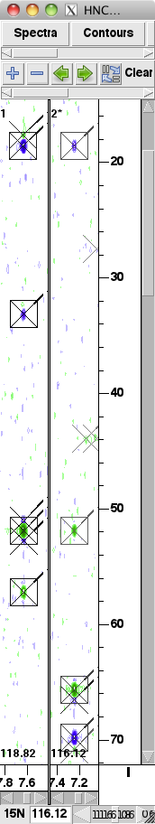

## spin system overlap + peaktype assignment
 - data: ss-ss
 - explanation: ambiguities in peaktype (e.g. CA(i) vs. CA(i-1)) can be resolved along with overlapping ss-ss assignments
 - example:  note the matching chemical shifts between the two strips.
   Also, peaktype assignment is implied by the order: the matching peaks appear
   in each strip -- in the first, as the (i) peaks (which means the remaining peaks 
   in that strip are (i-1) peaks), and in the second as the (i-1) peaks (which 
   means the remaining peaks in that strip are (i) peaks)

## sequence-specific assignment
 - data: ss-residue
 - information used:
   * ss-sstype
   * primary sequence
   * BMRB statistics
   * ss-ss overlap
   * previous ss-residue assignments
 - example: using the A and S/T from the fragment, an appropriate spot was found in the sequence

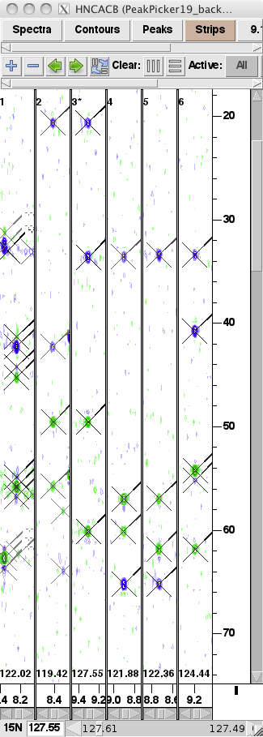
