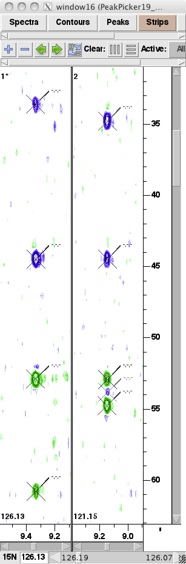

## automated tool
 - tool name
 - tool parameters
  
## spectral rereference
 - source: spectrum used as "correct" one
 - to: spectrum being corrected
 - dims: dimensions affected
 
## peak position: peak-peakclass
 - position: one of "edge", "projection", "expected empty region"
 
## peak pattern: peak-peakclass
 - pattern: one of "phase error", "truncation"

## remove non-signal peaks
 * peaks that are found to not be real signal peaks -- artifacts, noise -- should be removed from spin systems
 
## sign of peak amplitude: peak-peaktype

## fix mistake
 - explanation

## basic spin system creation
 - spectrum: spectrum in which the base peaks appear

## chemical shift matching: peak-ss
 - from: spectrum in which the peaks are already assigned to an ss, used for comparison
 - to: spectrum in which the peaks will be assigned to an ss
 - tolerances

## chemical shift matching: peak-peakclass
 * the lack of expected matching peaks in other spectra can indicate that a peak is noise or artifactual
 - from
 - to
 - tolerances

## chemical shift matching: peak and peak-peaktype
 * use a peak-ss to find a peak in another spectrum. 
     Example: use a CB(i-1) peak from an HNCACB to find a CB(i-1) peak in a C(CO)NH-Tocsy.
   use a peak-ss + ss-ss to find a peak and its peaktype
     Example: use a CB(i-1) to find a CB(i) peak in the preceding ss

## sidechain Trp
 - using: one or more of "BMRB statistics", "peak pattern"

## sidechain Asn/Gln
 - using: one or more of "BMRB statistics", "peak pattern"

## sidechain Arg
 - using: one or more of "BMRB statistics", "peak pattern"

## resolve overlap: peak-ss
 - using: one ore more of "ss-sstype", "peak pattern", "additional spectra"

## experiment/ss-sstype/sign: peak-peaktype
 * the pulse sequence, sstype, and peak sign can be used to deduce the peaktype: for example,
   in an HNCACB spectrum, the positive peak of a Gln sidechain is a CG and the negative is a CB (or vice versa)

## experiment/ss-sstype: peak-peaktype or ss-peak
 * similar to above.  Example:  NHSQC, backbone -> backbone N-H
 * also, ss-peak can be deduced.  Example: hbCBcgcdHD experiment targets aromatics; a peak from that spectrum
   that matches a spin system whose sstype is not an aromatic, can not be assigned to that spin system.

## backbone Ala
 * characteristic CB

## backbone Gly
 * characteristic CA, no CB

## backbone Ser/Thr
 * characteristic CB

## chemical shift matching: ss-ss and peak-peaktype
 * example: given two HNCACB strips, chemical shift matching, relative intensities, the
   sequential ss-ss assignments and CA(i)/CA(i-1) and CB(i)/CB(i-1) assignments can be made
   ss-ss must satisfy:
    - i-1 peaks in following ss should be matched by i peaks in preceding ss
    - intensity of HNCACB i-1 peaks should usually be less than intensity of i peaks in same ss
    - intensity of HNCACB i-1 peaks should usually be less than intensity of matching i peaks in preceding ss

## unexpected peak: peak-peakclass
 * a certain number of peaks are expected for a spin system in a given spectrum.
   Extra peaks may be likely to be artifacts or noise.

## fragment-sequence: ss-residue
 * can assign an ss chain to residues based on the amino acid types of the residues,
   the sstypes of the spin systems, and the order of the spin systems
 * can use process of elimination: if sstype is Arg, and there's only one unassigned Arg residue remaining,
   may assign the spin system to the Arg

## extend ss-residue fragment
 * a spin system fragment is already assigned to specific residues, and is extended at the ends
   in addition to the rules given in "chemical shift matching: ss-ss and peak-peaktype", the additional spin systems
   ss-sstype assignment must match the residue-aatype, or match the BMRB statistics if sstype is unassigned
   so what will get assigned is:
    - ss-ss
    - ss-residue
    - peak-peaktype

## BMRB statistics: peak-peaktype
 * the BMRB average chemical shift stats -- along with the sstype assignment -- are useful for spectra such as the 
   C(CO)NH-Tocsy, HBHA(CO)NH, and HC(CO)NH-Tocsy, where there are multiple peaks in a strip along a Carbon or Hydrogen dimension.
   For most amino acid types, there's good dispersion so it's easy to get the correct assignments straight from the stats.
   With others, it's necessary to be more careful or to come back and fix mistaken assignments later.

## Tocsy aliphatic sidechain: peak-peaktype
 * assign HNCACB and HBHA(CO)NH.  Then, use C(CO)NH-Tocsy, HC(CO)NH-Tocsy and HCCH-Tocsy in conjunction:
   use the C(CO)NH-Tocsy peaks to find HCCH-Tocsy strips, which gives proton chemical shifts and match
   the HC(CO)NH-Tocsy peaks.  Also, each HCCH-Tocsy strip should have peaks in all the same 1H shifts.
   BMRB statistics can be used to assign most peaktypes unambiguously.  Splitting patterns of also help
   to identify methylene groups.

## Tocsy peak pattern: peak-peaktype
 * Some aliphatic C/H groups are difficult to distinguish using BMRB statistics:
    - Leu, CG vs. CD1/CD2
    - Ile, CG2 vs. CD1, QG2 vs. QD1
   These can often be resolved by:
    - characteristic intensity patterns for each amino acid type due to Tocsy nature of experiment
    - methyl peaks are often sharper and more intense

## Cyana: stereospecific peak-peaktype
 * many pairs of atoms/groups give rise to two peaks.  The unambiguous assignments are not known,
   but it is known that each atom/group corresponds to one of the peaks, and the other atom/group
   to the other peak.
   Examples:  HB2/HB3 of Y, QD1/QD2 of L, QG1/QG2 of V, HD1/HD2 and HE1/HE2 of Y and F
   Cyana can often resolve these ambiguities during structure calculation.
